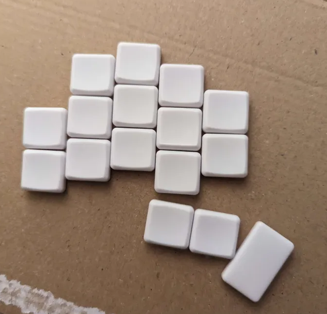
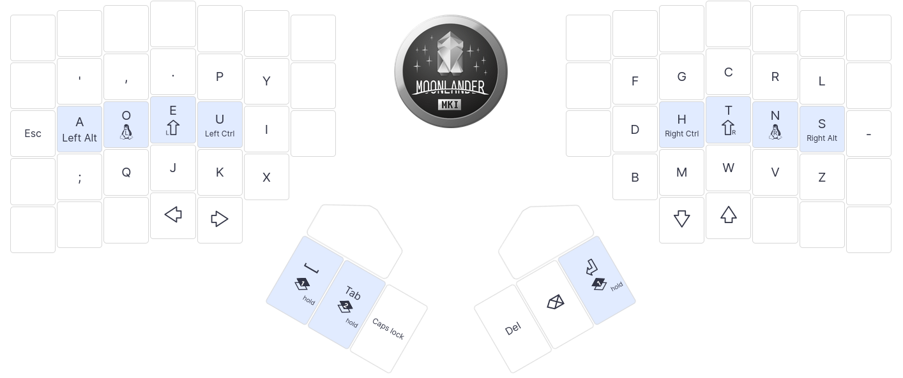

# Abyss

A 32 key split keyboard with a low pinky column.

## Build log

At first, I played with keycaps and cardboard to figure out what my layout should look like and then used
[ergogen](https://github.com/ergogen/ergogen) to create nice key shapes simply by editing some yml.

## Why?

I used the layout bellow from a moonlander, but I felt the pinky column was way too high, and it was a pain to reach the `l` on the right hand.
I also did not use a lot of the keys and wanted to learn a bit of electronics, so I decided to create a keyboard.

