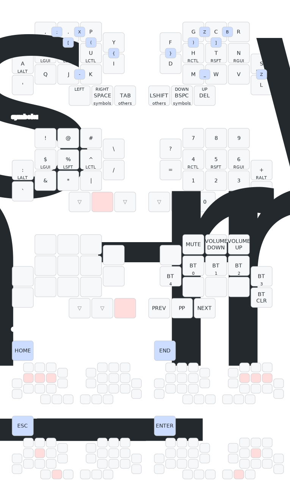

# Abyss

A 32 key split keyboard with a low pinky column.

## Components

| Count | Part name        | Size/Remark |
| :---: | :--------------  | :------ |
|   2x  | [Seed Xiao nRF54L15 - mcu](https://www.seeedstudio.com/XIAO-nRF54L15-p-6493.html) | |
|   2x  | [1208YD - reset button](https://fr.aliexpress.com/item/1005003938985112.html?spm=a2g0o.order_list.order_list_main.5.21ef1802F8o6h5&gatewayAdapt=glo2fra) | 6x6x7mm |
|   2x  | [401030 Li-Po Battery](https://www.ebay.com/itm/171812433827) | 4x10x30mm |
|  32x  | choc switch | i use [sunsets](https://lowprokb.ca/products/sunset-tactile-choc-switches) |
|  30x  | 1u choc keycaps | i use [pom](https://splitkb.com/products/moergo-pom-mbk-profile-keycaps?variant=42898367152387) |
|   2x  | 1.5u choc keycaps | i use [pom](https://splitkb.com/products/moergo-pom-mbk-profile-keycaps?variant=42898363121923) |
|  32x  | hotswap chock sockets | |
|  32x  | diodes | |
|  14x  | magnets | 3x6mm |
|   6x  | magnets | [1x6mm](https://www.aliexpress.us/item/3256809531283174.html?spm=a2g0o.productlist.main.4.40ba51212c0Deo&aem_p4p_detail=202509010522466451792268114080006371275&algo_pvid=7e6d70c3-9fac-491e-ad4b-6f626d5bf2e2&algo_exp_id=7e6d70c3-9fac-491e-ad4b-6f626d5bf2e2-3&pdp_ext_f=%7B%22order%22%3A%221%22%2C%22eval%22%3A%221%22%7D&pdp_npi=6%40dis%21USD%214.46%213.21%21%21%214.46%213.21%21%402103868817567293667515955e9050%2112000049939869309%21sea%21US%210%21ABX%211%210%21n_tag%3A-29910%3Bd%3A8c8b81cd%3Bm03_new_user%3A-29895&curPageLogUid=1SsSuJ8YjbqV&utparam-url=scene%3Asearch%7Cquery_from%3A%7Cx_object_id%3A1005009717597926%7C_p_origin_prod%3A&search_p4p_id=202509010522466451792268114080006371275_1) |
|   4x  | m2 screws | 4/6/8mm, |
|   4x  | m2 standoff | [<6mm wide, 6mm height](https://www.aliexpress.us/item/3256804230166399.html?spm=a2g0o.productlist.main.6.3a56Op21Op215V&algo_pvid=0788da77-fa40-49b3-9d72-f4cf68a2b90f&algo_exp_id=0788da77-fa40-49b3-9d72-f4cf68a2b90f-5&pdp_ext_f=%7B%22order%22%3A%22229%22%2C%22eval%22%3A%221%22%7D&pdp_npi=6%40dis%21USD%212.35%210.99%21%21%212.35%210.99%21%40211b655217567292930196247e11b4%2112000029108517137%21sea%21US%210%21ABX%211%210%21n_tag%3A-29910%3Bd%3A8c8b81cd%3Bm03_new_user%3A-29895%3BpisId%3A5000000174221208&curPageLogUid=uw39hgxJul2o&utparam-url=scene%3Asearch%7Cquery_from%3A%7Cx_object_id%3A1005004416481151%7C_p_origin_prod%3A#nav-description)|

## Info

Case height: 10.5mm -> 1.6mm (pcb) + 3.1mm (hotswap socket) + 5.5mm (choc size on top of the pcb)

## Keymap

