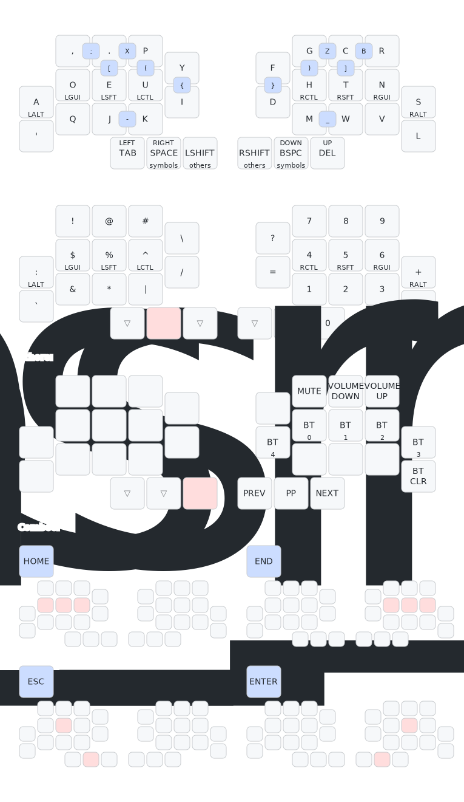

# Abyss

A 32 key split keyboard with a low pinky column.

## Components

- [Seed Xiao - mcu](https://www.seeedstudio.com/Seeed-XIAO-BLE-nRF52840-p-5201.html)
- [1208YD - power switch](https://www.aliexpress.us/item/1005001453441011.html?gatewayAdapt=4itemAdapt#nav-specification)
- [401030 Li-Po Batter - 4x10x30mm battery](https://www.ebay.com/itm/171812433827)

## Info

 Case height:  1.6mm (pcb) + 3.1mm (hotswap socket) + 5.5mm (choc size on top of the pcb)

## Keymap

